# sex-and-the-city-language-analysis
'It wasn’t logic, it was love' and other quotes # sexandthecity

        

 ## Table of contents
* [General info](#general-info)
* [Technologies](#technologies)
* [Setup](#setup)
* [Status](#status)

## General info
This project is natural language processing (NLP) analysis of all the lines from the 'Sex and the City' TV series. 
	
## Technologies
Project is created with Python - version: 3.8.5.

Python libraries:
* nltk - version 3.5
* pandas - version 1.1.1
* numpy - version 1.19.1
* matplotlib - version 3.3.1
* seaborn - version 0.10.1
  
## Setup
The input data consists of a single csv file (SATC_all_lines.csv). This is a dataset sourced from Kaggle (https://www.kaggle.com/snapcrack/every-sex-and-the-city-script).

The analysis and its results are stored in the Jupyter Notebook file (sex-and-the-city-lines.ipynb). 

## Screenshots

Characters with the largest number of lines

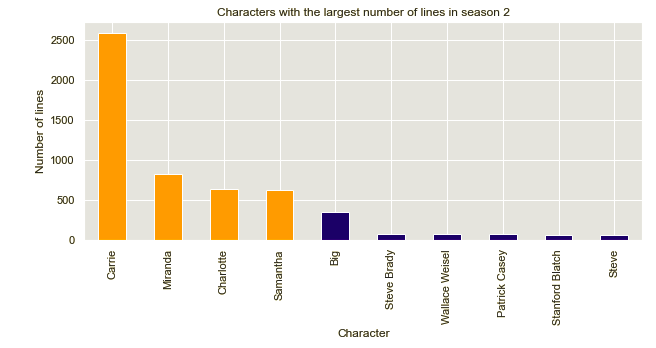
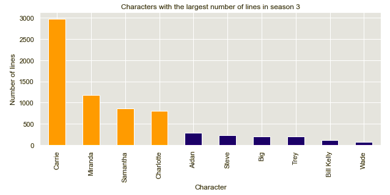
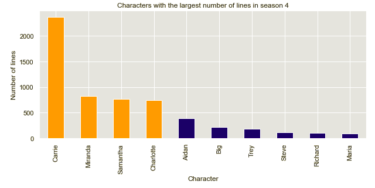
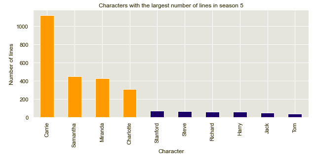
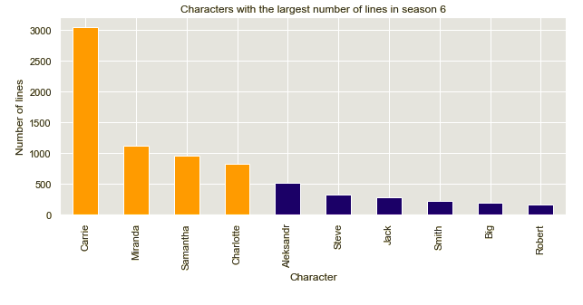

The 'Sex And The City' quotes search engine

1. Quotes about cities and places

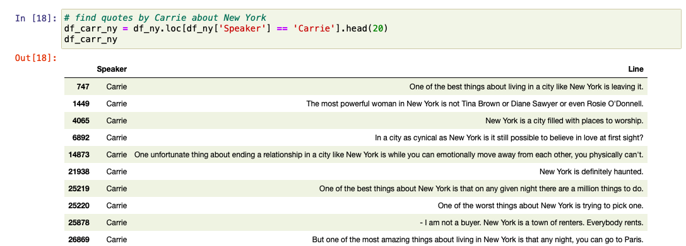
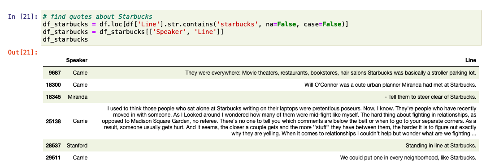

2. Quotes about men and women 

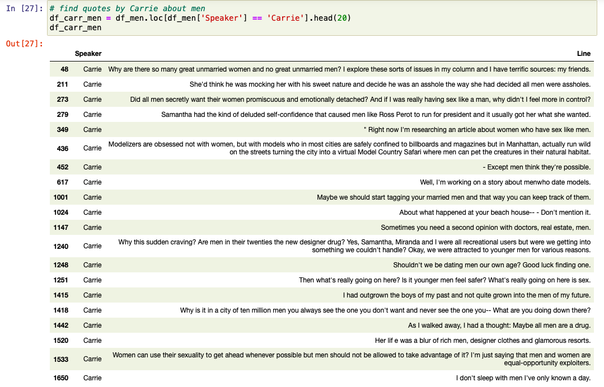
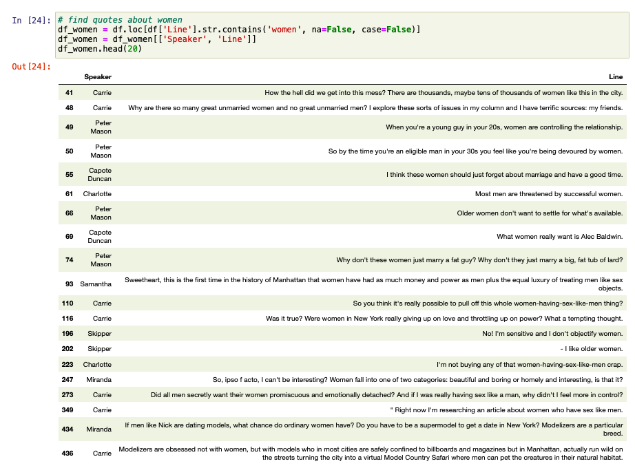

3. Quotes about food, fashion and lifestyle

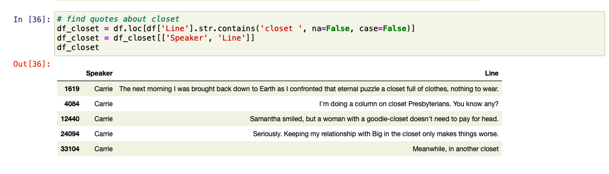

4. Quotes about appearance 

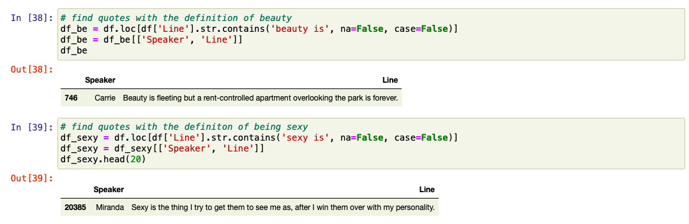

5. Quotes about relationships and emotions

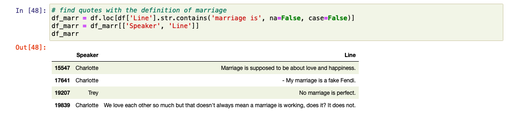

6. Other quotes

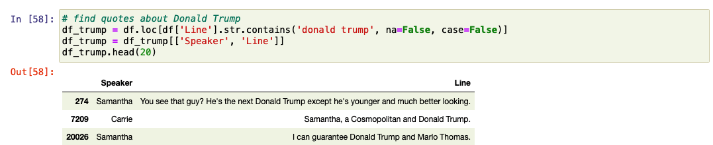

## Status
This project is still in progress.
